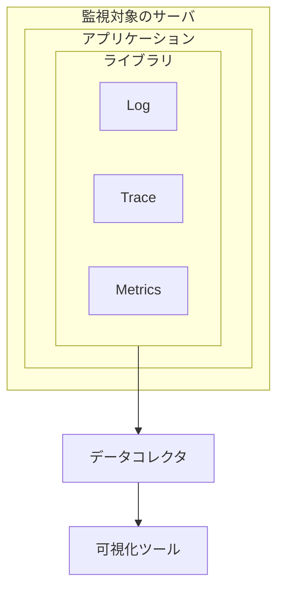

Monitoring
===

サーバの状態を監視すること。

```mermaid
graph TD
    subgraph 監視対象のサーバ
        subgraph アプリケーション
            subgraph ライブラリ
                Log
                Trace
                Metrics
            end
        end
    end

    ライブラリ --> データコレクタ

    データコレクタ --> 可視化ツール

```

## Observability

可観測性。

システムの出力から内部状態をどの程度適切に推測することができるかの尺度。

https://github.com/cncf/tag-observability/blob/main/whitepaper.md
