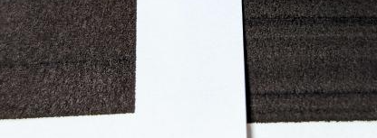

tiff-rich-black
===

tiffファイルの特定の色を無理やり変更するために作成しました。

## 📝 CMYKにおける黒について

色々あるみたい。

種類 | CMYK値 | 解説
--- | --- | ---
スミベタ | C0% M0% Y0% K100% | オーバープリント処理により他の色が透けて見える場合がある。 白抜けが発生しやすくなる。
リッチブラック | C40% M40% Y40% K100% | 色ズレが発生する場合がある。
4色ベタ | C100% M100% Y100% K100% | 乾きが遅い。 インクが滲み文字が見づらくなる場合がある。 

インクジェットプリンタで印刷して比較してみた。

* 右: 「4色ベタ」に近いもの。ムラが多め。
* 左: 黒の部分だけ無理やり「リッチブラック」化したもの。ちょっと赤っぽい？

